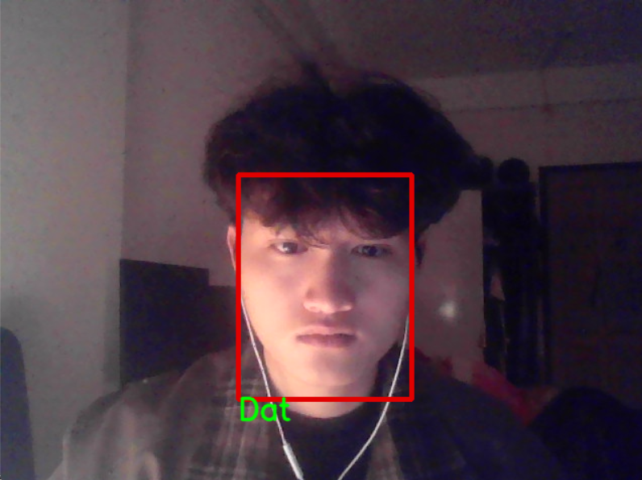

# Face Recognition with Liveness Detection

Real-time face recognition system integrating FaceNet embeddings with active liveness detection via head pose estimation and facial action units. Designed for identity verification with anti-spoofing capabilities.

## System Overview


## Key Features

- Face detection and recognition using FaceNet (InceptionResNetV2) with 128-D embeddings
- Head pose estimation (Pitch, Yaw, Roll) via MediaPipe Face Mesh with PnP solver
- Active liveness detection through facial action challenges (gaze direction, smile, blink)
- YOLOv8n-face detector for efficient real-time face localization
- L2-normalized embedding matching with cosine distance-based recognition

## System Pipeline

1. Face Detection: YOLOv8n-face locates faces in input frame (confidence threshold: 0.4)
2. Preprocessing: BGR→RGB conversion, normalization, resizing to 160×160
3. Embedding Extraction: InceptionResNetV2 generates 128-D feature vector
4. Liveness Verification: MediaPipe Face Mesh extracts 468 landmarks for head pose estimation (PnP solver)
5. Identity Matching: L2-normalized cosine distance comparison against enrolled embeddings (threshold: 0.3)

## Project Structure

```
Face_Recognition/
├── utils/
│   ├── DetectFace.py           # YOLO-based face detection
│   └── Embedding.py            # FaceNet embedding generation
├── models/
│   ├── facenet.py              # Recognition logic (cosine distance matching)
│   ├── Inception_Resnet.py     # InceptionResNetV2 architecture
│   └── yolov8n-face.pt         # Pre-trained YOLO weights
├── services/
│   ├── Detect_and_RecogFace.py # End-to-end pipeline
│   └── headPoseEstimation.py   # Facial action unit detection
├── apps/
│   ├── app.py                  # Streamlit interface
│   └── main1.py                # Real-time webcam inference
├── Leveness_Detection/         # Liveness validation module
├── data/                       # Training data + embeddings CSV
└── README.md
```


## Demo Results


## Technical Details

**Face Recognition**: Implements metric learning via L2-normalized embeddings. Query embedding compared against enrolled templates using cosine distance; accepts matches below 0.3 threshold. Mean pooling aggregates embeddings from multiple images per subject.

**Head Pose Estimation**: Leverages MediaPipe Face Mesh (468 landmarks) + OpenCV PnP solver to compute rotation angles (Pitch, Yaw, Roll). Enables pose-based liveness detection via angle thresholds: Yaw ±20° (lateral gaze), Pitch ±20° (vertical gaze).

**Liveness Detection**: Challenges include gaze direction (left/right/up/down), smile detection (lip-to-width ratio >0.2), blink detection (eye closure <6.5px), and forward gaze persistence (3 sec). Per-challenge timeout: 10 seconds.

**Models**:
- FaceNet (InceptionResNetV2): Pre-trained on VGGFace2
- YOLOv8n-face: Real-time face detection
- MediaPipe Face Mesh: Landmark detection & pose estimation

## Notes

All processing runs locally without cloud transmission. Recognition performance varies with training data quality and lighting conditions. GPU recommended for real-time performance.
